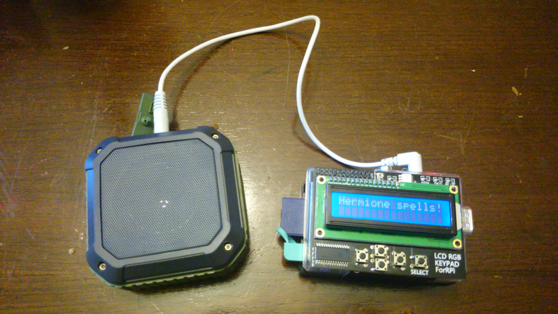

Configure a Raspberry Pi to play samples (of Hermione spells).

Press the buttons and a different sample is played for each button.

A project I built with my daughter so she can cast Hermione spells.

### Inventory of parts

 * Raspberry Pi (any model) running Tiny Core Linux with `node` and `alsa` modules installed.
 * LCD + buttons hat [like this](https://www.adafruit.com/product/772) or [this](https://www.aliexpress.com/item/I2C-IIC-16x2-RGB-LCD-Display-Shield-1602-Blue-Backlight-For-Raspberry-Pi-B-B/32772412372.html).
 * USB power pack (optional, for portability) - [example](https://www.aliexpress.com/item/Ultra-Thin-Powerbank-2600mAh-Portable-Charger-Backup-External-Battery-Mobile-Power-Bank-For-xiaomi-iPhone-4/32734996550.html).
 * USB powered speakears.

